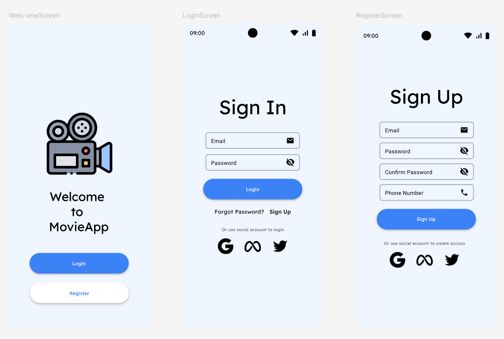
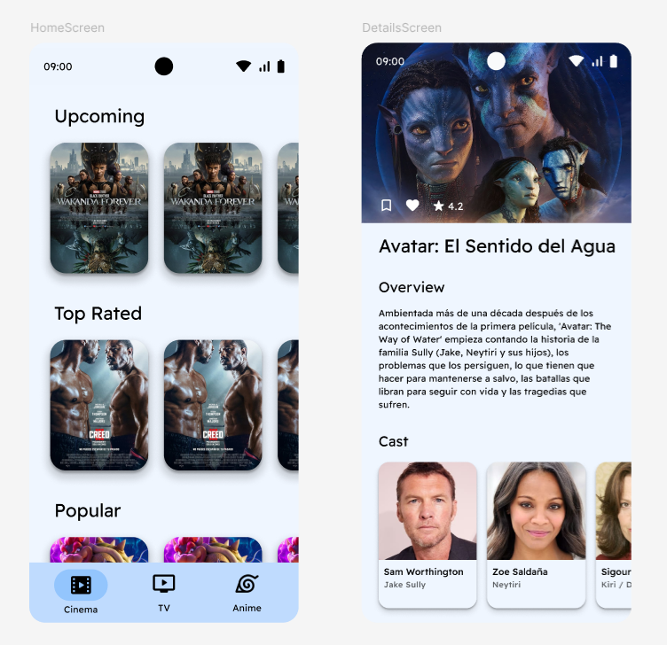

# 🎬 MovieApp - Tu app para informarte de pelis y series

¡Bienvenido a **MovieApp**!  
Una aplicación sencilla pero poderosa para estar al día con las películas en cartelera y las series actualmente en emisión.  
Descubre detalles importantes.

---

## 📸 Capturas de pantalla

---

## 🚀 Características

- 🔍 **Explora** películas y series populares en tiempo real.
- 📄 **Fichas detalladas** con sinopsis, elenco, puntuación y más.
- 🎨 Interfaz moderna y responsive.

---

## 🛠️ Tecnologías utilizadas

- **Lenguaje:** Kotlin
- **Frontend:** Jetpack compose
- **API:** [TMDb](https://www.themoviedb.org/)
- **Backend:** Kotlin Coroutines, viewmodel, Room, Retrofit

---

---

## ⚠️ Advertencia sobre la instalación del APK

> Al instalar la app mediante el archivo APK, Android puede mostrar una advertencia de seguridad.  
> Esto **no significa que la app sea peligrosa**, sino que:
>
> - No ha sido instalada desde la Play Store.
> - Es una versión de prueba sin firma verificada por Google.
>
> ✅ Puedes continuar con la instalación de forma segura si confías en el origen del archivo.

---

## 🔧 Instalación y uso
Para poder utilizar la app debes descargarte el apk
