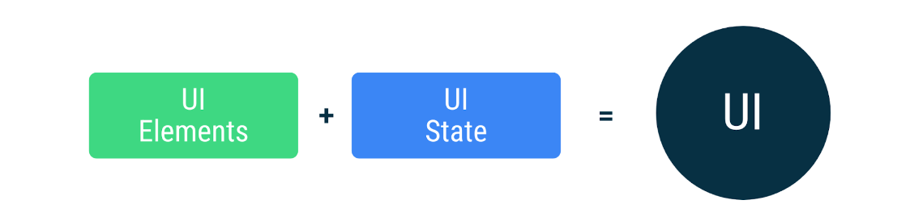
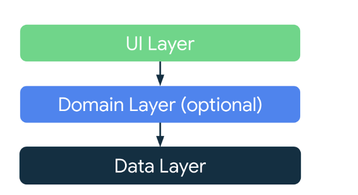
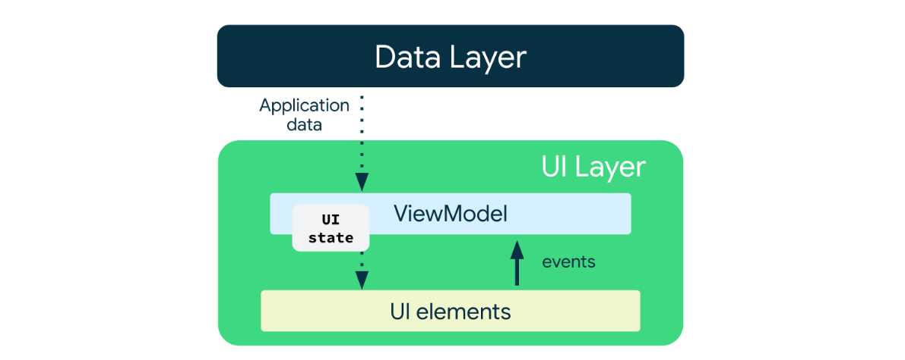
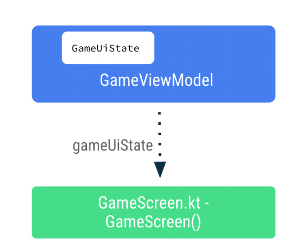
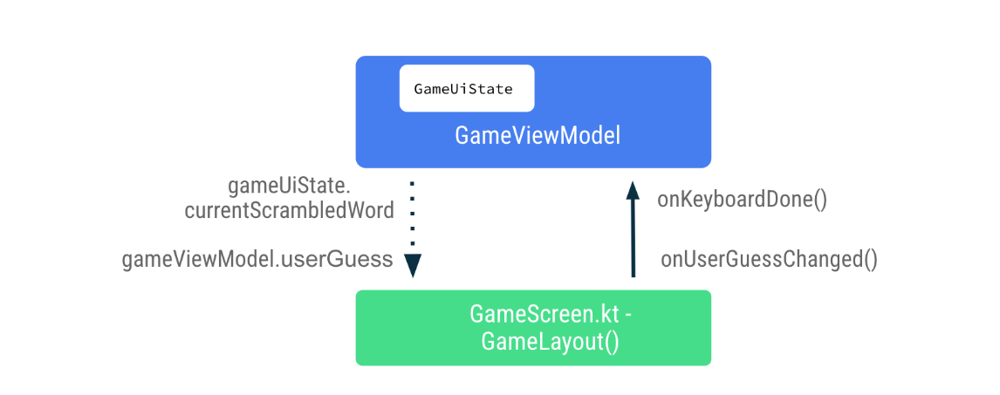

Navigation Concepts
• NavController: Es responsable de navegar entre los destinos, es decir, las pantallas en tu app.

NavGraph: Realiza la asignación de los destinos que admiten composición a los que se navegará.

• NavHost: Es eI elemento que admite composición y que funciona como contenedor para mostrar eI destino actual
del NavGraph.

EI método popBackStack() tiene dos parámetros obligatorios.
• route : Es la string que representa la ruta del destino al que deseas volver.
• inclusive : Es un valor booleano que, si es verdadero, también muestra (quita) la ruta especificada. Si es falso,
popBackStack() quitará todos los destinos que se encuentren sobre el de inicio (pero no este último), 10 que
hará que sea la pantalla superior visible para el usuario.

# Tareas Pendientes
- Implementar Pruebas
- Implementar diseño para diferentes pantallas